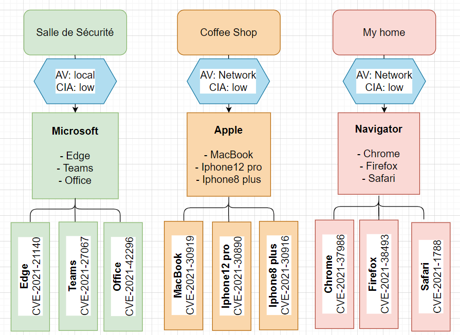

# BRIEF-CVE-VULNERABILITY

##### Environnements:

_1. Salle sécurisée_
_2. Coffee Shop_
_3. My home_

##### Thèmes:

_1. Microsoft:_
Edge: CVE-2021-21140
Teams: CVE-2021-27067
Office: CVE-2021-42296

_2. Apple:_
Mackbook: CVE-2021-30919
Iphone12 pro: CVE-2021-30890
Iphone8 plus: CVE-2021-30916

_3. Navigator:_
Chrome: CVE-2021-37986
Firefox: CVE-2021-38493
Safari: CVE-2021-1788

##### Pillule: 
_ Blue: Environnement bienveillant_

##### Schéma: 

##### Analyse: 

**1. Microsoft:**

- **Edge**
- **CVE-2021-21140**
Vector: CVSS:3.1/AV:P/AC:L/PR:N/UI:N/S:U/C:H/I:H/A:H
Base Score: 6.8/10
Le score calculé CVSS: 4.5/10
Lien: https://nvd.nist.gov/vuln-metrics/cvss/v3-calculator?vector=AV:P/AC:L/PR:N/UI:N/S:U/C:H/I:H/A:H/CR:L/IR:L/AR:L/MAV:L/MAC:L/MPR:N/MUI:N/MS:U/MC:L/MI:L/MA:L&version=3.1

<u>Conclusion:</u>

_Pour ce premier exemple, je vais détailler les explications afin de vulgariser au maximum le jargon utilisé._

Nous sommes dans une salle sécurisée et nous sommes connectés en local, c'est à dire que les données sont stockées de manière centralisée sur l'ordinateur serveur, il est également facile de gérer les données à un seul endroit et les données seront également plus sécurisées grâce à une sécurité accrue pour l'ordinateur serveur. 
La mise en place de cette sécurité a engendré une baisse du score CVSS "Common Vulnerability Scoring System" de 6.8/10 à 4.5/10, plus notre CVSS est faible, plus on considère qu'on est en sécurité. 
L'attaquant a plus de difficulté pour accéder à notre environnement ainsi que d'exploiter les données car notre Attack Vector est définit en local.
Attack Vector est un mode d'entrée dans un ordinateur ou un système en réseau, permettant à une personne ayant une intention malveillante d'endommager, de contrôler ou d'interférer de quelque manière que ce soit avec les opérations.
Les indicateurs d'impact, qu'on appelle CIA "Confidentiality, Intergrity, Availibility" sont des indicateurs faibles ce qui présente un impact sur les données stockées. 
La confidentialité signifie que les données, les objets et les ressources sont protégés contre les visualisations et autres accès non autorisés. L'intégrité signifie que les données sont protégées contre les modifications non autorisées afin de garantir leur fiabilité et leur exactitude. La disponibilité signifie que les utilisateurs autorisés ont accès aux systèmes et aux ressources dont ils ont besoin.
Vu que le score est à 4.5/10, on considère que nous sommes assez sécurisé pour une attaque.

- **Teams**
- **CVE-2021-27067**
Vector: CVSS:3.1/AV:N/AC:L/PR:L/UI:N/S:U/C:H/I:N/A:N
Base Score: 6.8/10
Le score calculé CVSS: 4.5/10
Lien: https://nvd.nist.gov/vuln-metrics/cvss/v3-calculator?vector=AV:N/AC:L/PR:L/UI:N/S:U/C:H/I:N/A:N/CR:L/IR:L/AR:L/MAV:L/MAC:L/MPR:L/MUI:N/MS:U/MC:L/MI:L/MA:L&version=3.1

<u>Conclusion:</u>

Nous sommes dans une salle sécurisée et connectés en local, ce qui justifie la baisse du score CVSS de 6.8/10 à 4.5/10. 
L'attaquant a plus de difficulté pour accéder à notre environnement ainsi que d'exploiter les données car notre Attack Vector est définit en local.
Les CIA sont des indicateurs faibles ce qui présente un impact sur les données stockées. 
Vu que le score est à 4.5/10, on considère que nous sommes assez sécurisé pour une attaque.

- **Office**
- **CVE-2021-42296**
Vector: CVSS:3.1/AV:L/AC:L/PR:N/UI:R/S:U/C:H/I:H/A:H
Base Score: 7.8/10
Le score calculé CVSS: 3.8/10
Lien: https://nvd.nist.gov/vuln-metrics/cvss/v3-calculator?vector=AV:L/AC:L/PR:N/UI:R/S:U/C:H/I:H/A:H/CR:L/IR:L/AR:L/MAV:L/MAC:L/MPR:N/MUI:R/MS:U/MC:L/MI:L/MA:L&version=3.1

<u>Conclusion:</u>

Nous sommes dans une salle sécurisée, ce qui justifie la baisse du score CVSS de 7.8/10 à 3.8/10. 
L'attaquant a plus de difficulté pour accéder à notre environnement ainsi que d'exploiter les données car notre Attack Vector est définit en local.
Les CIA sont des indicateurs faibles ce qui présente un impact sur les données stockées. 
Vu que le score est à 3.8/10, on considère que nous sommes assez sécurisé pour une attaque.

**2. Apple:**

- **MackBook**
- **CVE-2021-30919**
Vector: CVSS:3.1/AV:L/AC:L/PR:N/UI:R/S:U/C:H/I:H/A:H
Base Score: 7.8/10
Le score calculé CVSS: 4.8/10
Lien: https://nvd.nist.gov/vuln-metrics/cvss/v3-calculator?vector=AV:L/AC:L/PR:N/UI:R/S:U/C:H/I:H/A:H/CR:L/IR:L/AR:L/MAV:N/MAC:L/MPR:N/MUI:R/MS:U/MC:L/MI:L/MA:L&version=3.1

<u>Conclusion:</u>

Nous sommes dans un coffe Shop, la sécurité des données est censée être médiocre mais nous sommes connectés en local, ce qui justifie la baisse du score CVSS de 7.8/10 à 4.8/10. 
L'attaquant a plus de difficulté pour accéder à notre environnement ainsi que d'exploiter les données car notre Attack Vector est définit en local.
Les CIA sont des indicateurs faibles ce qui présente un impact sur les données stockées. 
Vu que le score est à 4.8/10, on considère que nous sommes assez sécurisé pour une attaque.

- **Iphone12 pro**
- **CVE-2021-30890**
Vector: CVSS:3.1/AV:N/AC:L/PR:N/UI:R/S:C/C:L/I:L/A:N
Base Score: 6.1/10
Le score calculé CVSS: 5.3/10
Lien: https://nvd.nist.gov/vuln-metrics/cvss/v3-calculator?vector=AV:N/AC:L/PR:N/UI:R/S:C/C:L/I:L/A:N/CR:L/IR:L/AR:L/MAV:N/MAC:L/MPR:N/MUI:R/MS:C/MC:L/MI:L/MA:L&version=3.1

<u>Conclusion:</u>

Nous sommes dans un coffe Shop, la sécurité des données est censée être médiocre mais nous sommes connectés en local, ce qui justifie la baisse du score CVSS de 6.1/10 à 5.3/10. 
L'attaquant a plus de difficulté pour accéder à notre environnement ainsi que d'exploiter les données car notre Attack Vector est définit en local.
Les CIA sont des indicateurs faibles ce qui présente un impact sur les données stockées. 
Vu que le score est à 5.3/10, on considère que nous sommes assez sécurisé pour une attaque.

- **Iphone8 plus**
- **CVE-2021-30916**
Vector: CVSS:3.1/AV:L/AC:L/PR:N/UI:R/S:U/C:H/I:H/A:H
Base Score: 7.8/10
Le score calculé CVSS: 4.8/10
Lien: https://nvd.nist.gov/vuln-metrics/cvss/v3-calculator?vector=AV:L/AC:L/PR:N/UI:R/S:U/C:H/I:H/A:H/CR:L/IR:L/AR:L/MAV:N/MAC:L/MPR:N/MUI:R/MS:U/MC:L/MI:L/MA:L&version=3.1

<u>Conclusion:</u>

Nous sommes dans un coffe Shop, la sécurité des données est censée être médiocre mais nous sommes connectés en local,  ce qui justifie la baisse du score CVSS de 7.8/10 à 4.8/10. 
L'attaquant a plus de difficulté pour accéder à notre environnement ainsi que d'exploiter les données car notre Attack Vector est définit en local.
Les CIA sont des indicateurs faibles ce qui présente un impact sur les données stockées. 
Vu que le score est à 4.8/10, on considère que nous sommes assez sécurisé pour une attaque.

**3. Navigator:**

- **Chrome**
- **CVE-2021-37986**
Vector: CVSS:3.1/AV:N/AC:L/PR:N/UI:R/S:U/C:H/I:H/A:H
Base Score: 8.8/10
Le score calculé CVSS: 4.8/10
Lien: https://nvd.nist.gov/vuln-metrics/cvss/v3-calculator?vector=AV:N/AC:L/PR:N/UI:R/S:U/C:H/I:H/A:H/CR:L/IR:L/AR:L/MAV:N/MAC:L/MPR:N/MUI:R/MS:U/MC:L/MI:L/MA:L&version=3.1

<u>Conclusion:</u>

Nous sommes à la maison et connectés à un réseau local, ce qui justifie la baisse du score CVSS de 8.8/10 à 4.8/10. 
L'attaquant a plus de difficulté pour accéder à notre environnement ainsi que d'exploiter les données car notre Attack Vector est définit en local.
Les CIA sont des indicateurs faibles ce qui présente un impact sur les données stockées. 
Vu que le score est à 4.8/10, on considère que nous sommes assez sécurisé pour une attaque.

- **Firefox**
- **CVE-2021-38493**
Vector: CVSS:3.1/AV:N/AC:L/PR:N/UI:R/S:U/C:H/I:H/A:H
Base Score: 8.8/10
Le score calculé CVSS: 4.8/10
Lien: https://nvd.nist.gov/vuln-metrics/cvss/v3-calculator?vector=AV:N/AC:L/PR:N/UI:R/S:U/C:H/I:H/A:H/CR:L/IR:L/AR:L/MAV:N/MAC:L/MPR:N/MUI:R/MS:U/MC:L/MI:L/MA:L&version=3.1

<u>Conclusion:</u>

Nous sommes  à la maison et connectés à un réseau local, ce qui justifie la baisse du score CVSS de 8.8/10 à 4.8/10. 
L'attaquant a plus de difficulté pour accéder à notre environnement ainsi que d'exploiter les données car notre Attack Vector est définit en local.
Les CIA sont des indicateurs faibles ce qui présente un impact sur les données stockées. 
Vu que le score est à 4.8/10, on considère que nous sommes assez sécurisé pour une attaque.

- **Safari**
- **CVE-2021-1788**
Vector: CVSS:3.1/AV:N/AC:L/PR:N/UI:R/S:U/C:H/I:H/A:H
Base Score: 8.8/10
Le score calculé CVSS: 4.8/10
Lien: https://nvd.nist.gov/vuln-metrics/cvss/v3-calculator?vector=AV:N/AC:L/PR:N/UI:R/S:U/C:H/I:H/A:H/CR:L/IR:L/AR:L/MAV:N/MAC:L/MPR:N/MUI:R/MS:U/MC:L/MI:L/MA:L&version=3.1

<u>Conclusion:</u>

Nous sommes  à la maison et connectés à un réseau local, ce qui justifie la baisse du score CVSS de 8.8/10 à 4.8/10. 
L'attaquant a plus de difficulté pour accéder à notre environnement ainsi que d'exploiter les données car notre Attack Vector est définit en local.
Les CIA sont des indicateurs faibles ce qui présente un impact sur les données stockées. 
Vu que le score est à 4.8/10, on considère que nous sommes assez sécurisé pour une attaque.